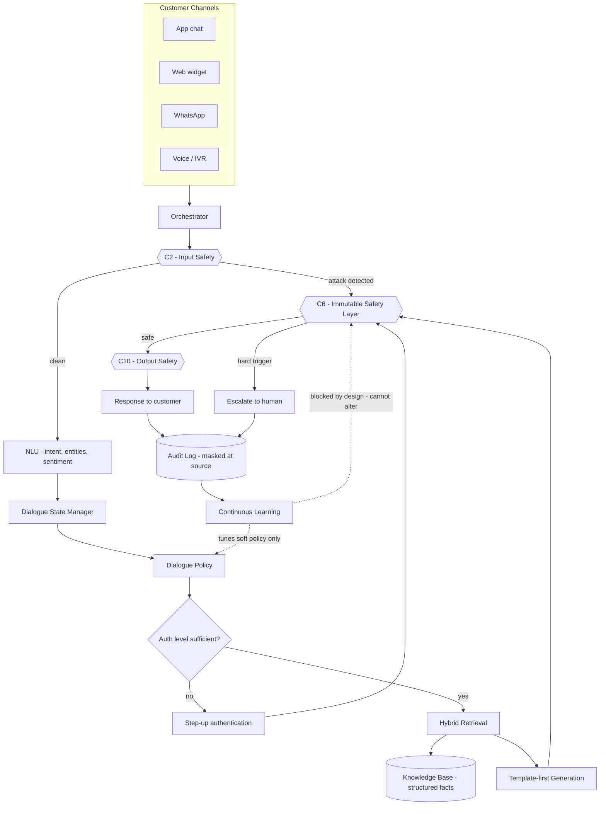
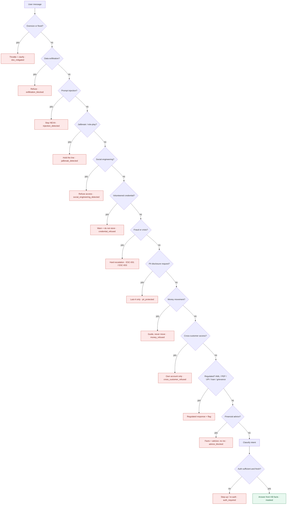
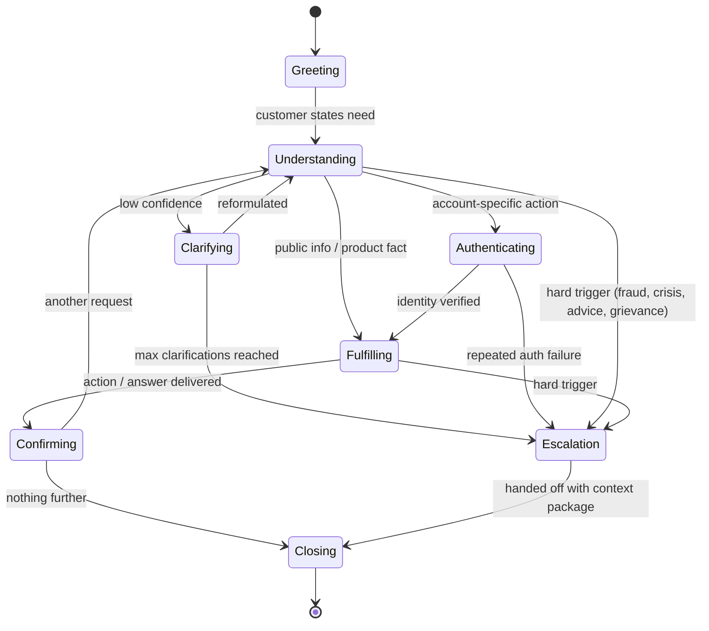
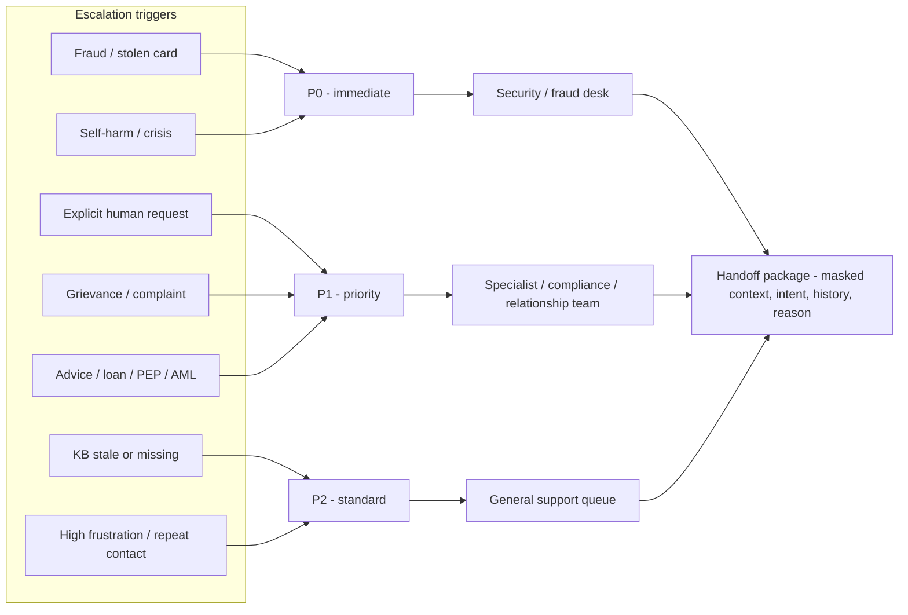
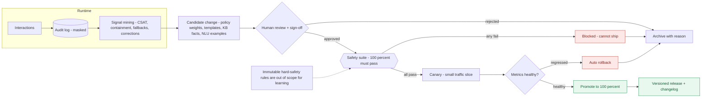
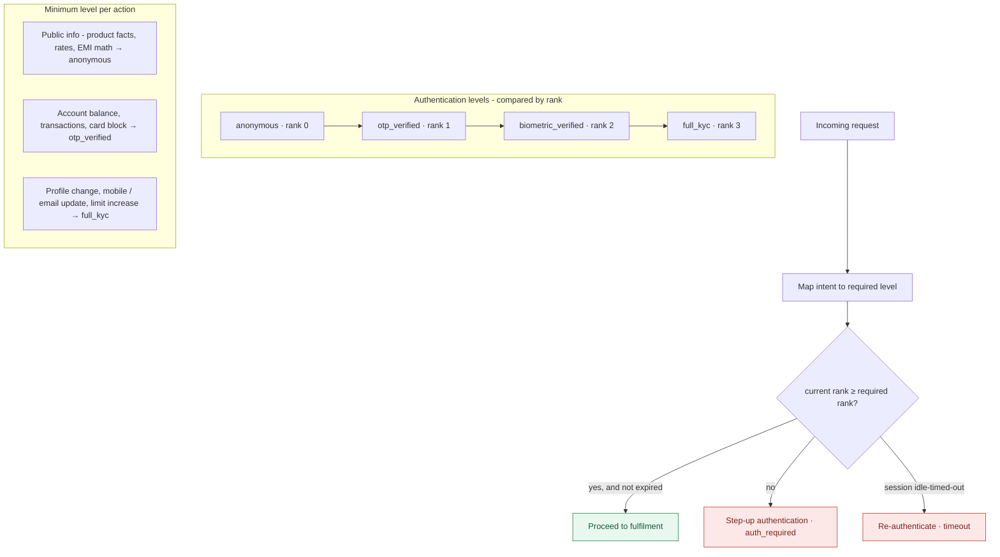

# NEXA — System Diagrams

Six diagrams that describe the NexBank customer-service agent (**NEXA**). They are written
in [Mermaid](https://mermaid.js.org/) so they render directly on GitHub and stay in version
control alongside the code. Each `.mermaid` source file in this folder is embedded below.

The diagrams are intentionally consistent with the runnable demo in `src/nexbank_agent/`:
diagram **02** mirrors the ordered checks in `engine.py`, **06** mirrors the auth-rank gate,
and **05** mirrors the safety-gated learning pipeline described in `docs/learning-pipeline.md`.

## Contents

1. [System architecture](#1-system-architecture) — end-to-end request flow
2. [Guardrail pipeline](#2-guardrail-pipeline) — the ordered safety checks
3. [Dialogue state machine](#3-dialogue-state-machine) — conversation lifecycle
4. [Escalation routing](#4-escalation-routing) — triggers → priority → human queue
5. [Learning loop](#5-learning-loop) — how the system improves without weakening safety
6. [Authentication ladder](#6-authentication-ladder) — levels and the step-up gate

---

## 1. System architecture

End-to-end path of a single message. Safety is enforced at three chokepoints (C2 input,
C6 immutable, C10 output). The learning loop can tune *soft* policy but is **blocked by
design** from altering the immutable C6 layer.

---

## 2. Guardrail pipeline

The ordered decision chain implemented in `engine.evaluate()`. Safety checks run **before**
any capability, and the order matters: exfiltration/injection/jailbreak are caught before
the advice check so an attack is never mislabelled as a product question.

---

## 3. Dialogue state machine

The lifecycle of a conversation. Any hard trigger (fraud, crisis, disallowed advice,
grievance) can move the dialogue straight to escalation from either understanding or
fulfilment.

---

## 4. Escalation routing

How a trigger is mapped to a priority and routed to the right human queue. Every handoff
carries a **masked context package** so the customer never has to repeat themselves and no
raw PII crosses the boundary.

---

## 5. Learning loop

The system improves continuously, but every candidate change must pass the **full safety
suite at 100%** before it can ship, then go through canary + automatic rollback. The
immutable hard-safety rules are explicitly **out of scope** for learning — that is the
central design commitment: learning can tune soft policy but can never weaken hard safety.

---

## 6. Authentication ladder

Four levels compared by **rank**. Each intent maps to a minimum required level; the gate
proceeds only when the current rank meets or exceeds it and the session has not idle-timed-out.

