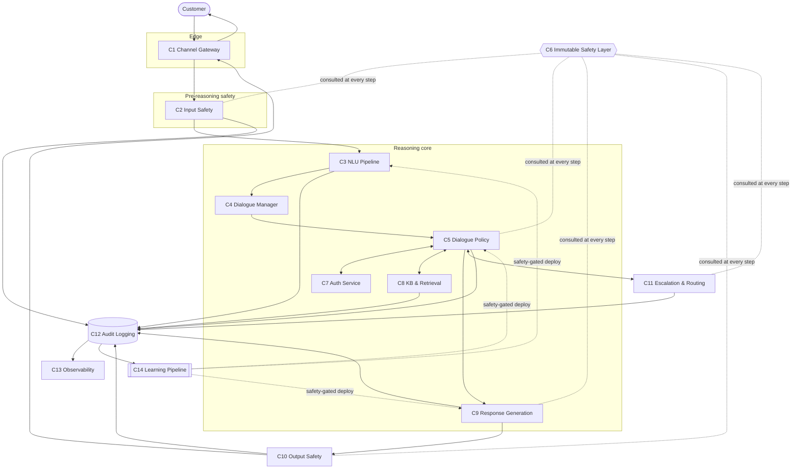

# System Architecture — NexBank NEXA

**Deliverable:** L1 (Architecture & Dialogue Management) · **Owner:** Conversational AI Architect
**Companion docs in this folder:** [`audit-logging.md`](audit-logging.md) · [`risk-assessment.md`](risk-assessment.md)
**Diagrams:** [`../../diagrams/`](../../diagrams/)

This document specifies NEXA's runtime architecture in enough detail to be built by an ML/platform team: component responsibilities and interfaces, the dialogue state model and state machine, the dialogue policy, multi-turn reasoning, failure modes, the latency budget, and the scalability plan.

---

## 1. Design principles

1. **Capability core, immutable safety shell.** Learned/probabilistic components (NLU model, LLM generator, retrieval) sit *inside* a deterministic, rule-based safety layer that the learning pipeline cannot modify. Zero-incorrect-advice and PII rules are not left to a model.
2. **Two guardrail chokepoints.** Input safety runs *before* the model reasons (prompt-injection, PII pre-scan); output safety runs *after* generation (hallucination, PII leak, financial accuracy, tone, commitment).
3. **Template-first for facts, LLM for feeling.** Numbers, balances, rates, and regulatory text are template-rendered from authoritative sources; the LLM handles empathy, clarification, and phrasing only.
4. **Fail safe, not fail open.** Every component's fallback path degrades toward human escalation, never toward guessing.
5. **Everything is logged and traceable.** Each turn is attributable to specific inputs, model version, KB entries, and guardrail decisions (see `audit-logging.md`).
6. **Model-swappable.** No component is coupled to a specific LLM/embedding provider; all are behind interfaces (Part E5 constraint).

---

## 2. Component catalogue (14 components)

| # | Component | Responsibility | Type |
|---|---|---|---|
| C1 | **Channel Gateway** | Ingress/egress for chat, in-app, WhatsApp, voice (via STT/TTS adapters); session lifecycle, rate limiting, DoS controls | Stateless service |
| C2 | **Input Safety Layer** | Prompt-injection detection, instruction/data separation, inbound PII pre-scan, abuse/DoS scoring | Rule + model |
| C3 | **Language & NLU Pipeline** | Language detection, hierarchical intent classification, entity extraction + validation, sentiment/emotion | Model + rules |
| C4 | **Dialogue Manager (State Tracker)** | Owns the dialogue state object; reads/writes hot state; slot-filling bookkeeping; history windowing | Stateful service |
| C5 | **Dialogue Policy Engine** | Chooses the next action from the action space given state; confirmation/clarification/recovery/proactive strategies | Rule + learned |
| C6 | **Immutable Safety Layer (Policy Guard)** | Deterministic, un-learnable safety rules consulted at every decision; can veto/override any action | Rule-based (immutable) |
| C7 | **Authentication & Authorization Service** | Auth-level state (anonymous → OTP → biometric → full-KYC), step-up auth, action authorization | Stateful service |
| C8 | **Knowledge Base & Retrieval Service** | Hybrid retrieval + re-ranking over the versioned KB; freshness/TTL and access control enforcement | Service + vector/BM25 store |
| C9 | **Response Generation Service** | Template renderer + LLM generator + hybrid blender; persona/brand-voice control; length calibration | Template + LLM |
| C10 | **Output Safety Layer** | Financial-accuracy check, hallucination/grounding check, PII-leak scan, tone check, commitment detection | Rule + model |
| C11 | **Escalation & Routing Service** | Evaluates 15 triggers + escalation-proximity score; selects queue; builds handoff context package | Rule-based |
| C12 | **Audit & Compliance Logging** | Tamper-evident interaction- and turn-level logs; encryption; retention; regulatory reporting | Append-only store |
| C13 | **Observability & Metrics** | Real-time/daily/weekly dashboards; drift detection; anomaly alerts | Service |
| C14 | **Continuous Learning Pipeline** | Offline: feedback ingestion, dataset curation, training, safety-gated staged deployment | Offline/batch |

> Requirement asks for 8+ components; NEXA uses 14 so that safety (C6, C2, C10), auth (C7), audit (C12), and learning (C14) are each isolated, independently testable, and independently deployable.

Component diagram: [`../../diagrams/01-system-architecture.mermaid`](../../diagrams/01-system-architecture.mermaid). Inline version:



---

## 3. Request lifecycle

For each inbound customer message:

1. **C1 Channel Gateway** authenticates the channel/session, applies rate limits, normalises to a canonical `InboundMessage`.
2. **C2 Input Safety** scans for prompt injection, jailbreaks, and inbound PII; annotates or blocks. On high-confidence attack → hand to C5 with `attack_detected` flag (never to the raw model).
3. **C3 NLU** detects language, classifies intent (3-tier), extracts+validates entities, scores sentiment.
4. **C4 Dialogue Manager** loads/updates the dialogue state (intent, slots, history, sentiment trajectory, auth level, escalation-proximity).
5. **C5 Dialogue Policy** chooses an action, consulting **C6 Immutable Safety** (may veto), **C7 Auth** (is the action permitted at this auth level?), and **C8 Retrieval** (if knowledge is needed).
6. **C9 Response Generation** renders the response (template/LLM/hybrid).
7. **C10 Output Safety** validates the draft; on failure it repairs (re-template) or blocks + escalates.
8. **C11 Escalation** may pre-empt steps 6–7 for hard triggers (fraud, self-harm, AML, PEP).
9. **C1** returns the response; **C12** logs the full turn; **C13** updates metrics; sampled turns feed **C14**.

The same end-to-end request path is shown as a flow in the system-architecture diagram: [`../../diagrams/01-system-architecture.mermaid`](../../diagrams/01-system-architecture.mermaid).

---

## 4. Dialogue state schema

The dialogue state is the single source of truth for an active conversation. Held in a hot store (e.g. Redis) keyed by `conversation_id`, mirrored to durable audit logs.

```yaml
DialogueState:
  conversation_id: uuid
  customer_id: uuid_hashed | null        # null until authenticated
  channel: enum[chat, app, whatsapp, voice]
  language: enum[en, hi, hinglish, ta, te, bn, mr, gu]

  # --- NLU snapshot (current turn) ---
  current_intent:
    label: string                        # e.g. transaction.dispute.merchant_error
    confidence: float                    # 0..1
    alternatives: [{label, confidence}]  # top-k hypotheses (margin used for disambiguation)
  intent_history: [string]               # per-turn intent labels

  # --- Slot filling ---
  active_intent_slots:
    required: {slot_name: {value, status: [empty|filled|confirmed|invalid], confidence}}
    optional: {slot_name: {value, status, confidence}}

  # --- Conversation memory ---
  history_buffer: [{turn_id, speaker, text_redacted, ts}]  # configurable depth, min 20
  summary: string                        # rolling summary when history exceeds window

  # --- Affect ---
  sentiment:
    current: float                       # -1..1
    trajectory: [float]                  # per-turn, for slope
    dominant_emotion: enum[frustration, anger, confusion, satisfaction, urgency, anxiety, resignation, neutral]

  # --- Security & control ---
  auth_level: enum[anonymous, otp_verified, biometric_verified, full_kyc]
  auth_expires_at: ts                    # 5-min inactivity re-auth
  active_guardrails: [string]            # currently-armed guardrail ids
  attack_flags: [string]                 # from C2

  # --- Flow control ---
  escalation_proximity: float            # 0..1, updated every turn (see §6)
  pending_action: {type, payload} | null # e.g. awaiting confirmation
  turn_count: int
  context_carryover:
    prior_session_id: uuid | null
    open_complaint_ids: [string]
    unresolved_since: ts | null

  model_version: string                  # for traceability
```

Design notes: `escalation_proximity` and `attack_flags` are first-class so escalation and safety are *observable* state, not implicit behaviour. `summary` enables graceful handling of conversations beyond the history window (§7).

---

## 5. Dialogue state machine

Nine states with guarded transitions. Full diagram: [`../../diagrams/03-dialogue-state.mermaid`](../../diagrams/03-dialogue-state.mermaid).

| State | Meaning | Typical exits |
|---|---|---|
| `GREETING` | Session opened, AI-disclosure shown | → UNDERSTANDING |
| `UNDERSTANDING` | Classifying intent / extracting entities | → AUTHENTICATING, CLARIFYING, RETRIEVING, ESCALATING |
| `CLARIFYING` | Resolving ambiguity or missing slots | → UNDERSTANDING, RETRIEVING |
| `AUTHENTICATING` | Step-up auth for the requested action | → RETRIEVING/ACTING, ESCALATING (on failure) |
| `RETRIEVING` | Fetching knowledge/account data | → RESPONDING, ESCALATING |
| `CONFIRMING` | Awaiting yes/no before a state-changing/irreversible action | → ACTING, UNDERSTANDING (declined) |
| `RESPONDING` | Generating + safety-checking a reply | → UNDERSTANDING (next turn), CONFIRMING, ESCALATING |
| `ESCALATING` | Building handoff package, routing to human | → CLOSED |
| `CLOSED` | Resolved or handed off; CSAT prompt | terminal |

**Guards (examples).**
- `UNDERSTANDING → AUTHENTICATING` iff `action.required_auth > state.auth_level`.
- any → `ESCALATING` iff a hard trigger fires (fraud/self-harm/AML/PEP) **or** `escalation_proximity ≥ 0.8`.
- `RESPONDING → RESPONDING(repair)` iff C10 output-safety fails and a safe re-template exists; else → `ESCALATING`.
- `* → CLOSED` on 5-min inactivity (auth expiry) with re-auth on resume.

---

## 6. Dialogue policy

**Action space (8).** `respond · clarify · confirm · escalate · transfer · hold · recommend · apologise`.

**Decision logic — hybrid (rules gate, learned ranks).**
- **Hard rules first (C6).** Safety/auth/regulatory constraints can force or forbid an action regardless of anything the learned policy prefers. Example: a personalised-advice request *forces* `recommend`→advisory-escalation copy, never a direct recommendation.
- **Learned ranking second.** Within the set of *permitted* actions, a learned policy (bandit/RL, offline-trained) ranks by expected CSAT/resolution. This is a Layer-3+ component the learning pipeline may improve; it can never expand the permitted set.

**Strategies.**
- *Confirmation* (Confirmation-Before-Action pattern): any state-changing/irreversible action → summarise action + masked details → explicit yes/no → act → return reference number.
- *Clarification*: triggered by low top-1 confidence **or** small top-1/top-2 margin; ask one targeted question (never a generic "please rephrase" more than once — anti-pattern guard).
- *Recovery*: on misunderstanding, acknowledge, restate understanding, offer options; escalate after 2 failed recoveries.
- *Proactive*: after resolving, offer the single most-relevant next step (Progressive Disclosure), never an information dump.

**Escalation-proximity score** (updated each turn):
```
escalation_proximity = clamp(
    0.35 * low_confidence_streak_norm      # consecutive turns below intent threshold
  + 0.30 * negative_sentiment_norm         # |sentiment| when negative
  + 0.20 * turn_count_norm                 # long unresolved conversations
  + 0.15 * failed_recovery_norm , 0, 1)
# hard triggers set proximity = 1.0 immediately (bypass scoring)
```
This makes "escalate before the customer gives up" measurable and tunable (see `config/configuration-parameters.md`).

---

## 7. Multi-turn reasoning

| Capability | Approach |
|---|---|
| **Anaphora resolution** | Coreference over the history buffer; "it/that charge/the same card" resolved to the most recent matching entity in state. |
| **Topic-switch detection** | New-turn intent vs `current_intent`; on switch, push the prior intent's slot-filling context to a stack so it can resume (Context Carry-Over). |
| **Implicit intent** | Map indirect phrasing ("money left my account but didn't reach") to `transaction.upi.failure` via utterance patterns + retrieval. |
| **Contradiction handling** | If a new entity value conflicts with a confirmed slot, move slot to `invalid`, ask to confirm which is correct — never silently overwrite. |
| **Context-window management** | Sliding window keeps the last N turns verbatim; older turns compressed into `summary`; **priority retention** always keeps auth state, open `pending_action`, safety flags, and open complaint ids regardless of window. |

---

## 8. Component interface contracts

Contracts are transport-agnostic (gRPC/REST). Types abbreviated; full field lists in the state schema (§4) and `audit-logging.md`.

```text
C2 InputSafety.scan(InboundMessage) ->
    { sanitized_text, attack_flags[], pii_prescan[], block: bool, reason }

C3 NLU.analyze(sanitized_text, DialogueState) ->
    { language, intent{label,confidence,alternatives[]}, entities[{type,value,confidence,valid}], sentiment{score,emotion} }

C4 DialogueManager.update(DialogueState, NLUResult) -> DialogueState'          # pure state transition

C5 DialoguePolicy.decide(DialogueState') -> Action{type, params}               # constrained by C6 + C7

C6 SafetyLayer.check(DialogueState', Action|Draft) -> { allow: bool, override_action?, violations[] }

C7 Auth.authorize(DialogueState', Action) -> { permitted: bool, required_auth, step_up? }

C8 Retrieval.query(query, DialogueState') ->
    { items[{id, text, score, source, regulatory_tag, ttl_ok}], retrieval_confidence, grounded: bool }

C9 Generation.render(Action, DialogueState', RetrievalResult) ->
    { draft_text, method: template|llm|hybrid, citations[] }

C10 OutputSafety.verify(draft_text, DialogueState', RetrievalResult) ->
    { pass: bool, repaired_text?, violations[], must_escalate: bool }

C11 Escalation.evaluate(DialogueState') -> { escalate: bool, trigger_id, priority, queue, sla, context_package }
```

**Invariants across the boundary.** C6 is consulted by C2/C5/C9/C10/C11 and may veto any of them. C9 may only emit financial figures that C8 returned with `ttl_ok=true`; otherwise it must fail closed to a "let me connect you / can't confirm right now" template.

---

## 9. Failure-mode analysis

Every component fails toward safe escalation or a safe template — never toward guessing.

| Component | Failure mode | Detection | Fallback |
|---|---|---|---|
| C3 NLU | Model unavailable / low confidence | Health check; confidence < threshold | Rule-based intent shortlist → clarify; if still low → escalate (ESC-004) |
| C3 NLU | Entity mis-validation | Validation rule fails (Luhn/PAN) | Ask customer to re-share; never proceed on invalid PII |
| C8 Retrieval | Latency spike / store down | p95 monitor; timeout 200ms | Serve cached hot entries; if miss → uncertainty template, offer escalation |
| C8 Retrieval | Stale regulatory entry | `ttl_ok=false` | **Fail closed**: block figure, escalate to Compliance Helpdesk (ESC-008) |
| C9 Generation | LLM timeout / provider error | Timeout 1.5s; circuit breaker | Fall back to template-only response for the intent |
| C9 Generation | Hallucinated figure | C10 grounding check | Repair via template; if impossible → block + escalate |
| C10 Output Safety | Model unavailable | Health check | Fall back to deterministic rule checks (PII regex, figure match) — never skip |
| C4 State store | Hot store unavailable | Ping/latency | Reconstruct minimal state from last durable log; re-auth to be safe |
| C7 Auth | OTP service down | Error rate | Cannot elevate → restrict to LOW-safety intents; escalate for the rest |
| Cascading | Multiple components degraded | Circuit breaker + bulkheads | Rule-based "safe mode": greet, triage, escalate; no state changes |

Detailed technical/business/ethical risks: [`risk-assessment.md`](risk-assessment.md).

---

## 10. Latency budget (< 3s end-to-end, p95)

Two paths: the **template path** (facts) is fast; the **LLM path** (empathy/free text) dominates.

| Stage | Template path (ms) | LLM path (ms) |
|---|---|---|
| C1 ingress + normalise | 30 | 30 |
| C2 input safety | 40 | 40 |
| C3 NLU (intent+entity+sentiment) | 220 | 220 |
| C4 state update | 20 | 20 |
| C5 policy + C6 safety + C7 auth | 60 | 60 |
| C8 retrieval (hybrid + rerank, p95) | 190 | 190 |
| C9 generation | 60 (render) | 1500 (LLM p95) |
| C10 output safety | 120 | 300 |
| C1 egress | 30 | 30 |
| network/overhead | 100 | 120 |
| **Total p95** | **~870 ms** | **~2,510 ms** |

C12 logging and C13 metrics are **asynchronous** (0 ms on the critical path). Budget assumptions and how each number is defended live in `config/configuration-parameters.md`. The business SLA (<30s first reply) has ~10x headroom over the technical p95.

---

## 11. Scalability (1x / 10x / 100x)

Baseline **1x = 18,000 interactions/day** (~0.75 msg/s average; assume 5x peak = ~4 msg/s; ~750 concurrent conversations at peak).

| Dimension | 1x | 10x (180k/day) | 100x (1.8M/day) |
|---|---|---|---|
| Concurrent conversations (peak) | ~750 | ~7.5k | ~75k (≥ the 10k load-test target with headroom) |
| Stateless services (C1, C2, C3, C5, C9, C10) | 3–5 replicas | horizontal autoscale on QPS/latency | multi-AZ autoscale + regional sharding |
| Dialogue state (C4) | single Redis + replica | Redis cluster, sharded by `conversation_id` | multi-shard cluster; near-cache on app nodes |
| Retrieval (C8) | 1 vector index + BM25 | read replicas + hot-entry cache | index sharding + CDN for static KB |
| LLM generation (C9) | shared inference pool | autoscaled GPU pool + request queue | provider multiplexing, priority queue, template-path offload |
| Audit log (C12) | append-only DB | partitioned by date | tiered storage (hot→cold), stream to warehouse |
| Cost lever | — | cache + template-path ratio ↑ | raise template-path %, smaller distilled NLU model, batch LLM |

Reliability primitives at every scale: **circuit breakers, bulkhead isolation, rule-based safe-mode fallback**, and graceful load-shedding that prioritises P0 (fraud/security) traffic. Cost is kept mid-startup-reasonable by maximising the template path (no LLM cost) and using a small distilled model for NLU.

---

## 12. Technology choices (indicative, model-swappable)

| Concern | Indicative choice | Why / swap note |
|---|---|---|
| NLU model | Distilled transformer (e.g. DistilBERT-class) fine-tuned on the 500-transcript taxonomy | Small, fast, on-prem; swappable behind `C3` interface |
| Embeddings | Any sentence-embedding model (provider-agnostic) | Behind `C8`; dimension configurable |
| Vector + sparse store | Qdrant/Weaviate + BM25 (OpenSearch) | Hybrid; either half replaceable |
| LLM generator | Provider-agnostic via adapter | Only used on the empathy/free-text path; temperature 0.3 |
| Hot state | Redis | Any low-latency KV store |
| Audit log | Append-only, WORM-capable store | AES-256 at rest, TLS 1.3 in transit (see `audit-logging.md`) |
| Orchestration | Containerised microservices | Enables per-component scaling and deployment |

No component is bound to a named LLM provider; the `src/` demo mirrors this with a pluggable generator interface and a deterministic default.

---

### Cross-references
- Intents & entities that drive C3/C5: [`../intent-taxonomy/`](../intent-taxonomy/)
- Retrieval internals for C8: [`../knowledge-base/`](../knowledge-base/)
- Safety rules enforced by C6/C2/C10: [`../guardrails/`](../guardrails/)
- Triggers/queues for C11: [`../escalation/`](../escalation/)
- Metrics emitted to C13: [`../metrics/`](../metrics/)
- Learning loop feeding C14: [`../learning-pipeline/`](../learning-pipeline/)
