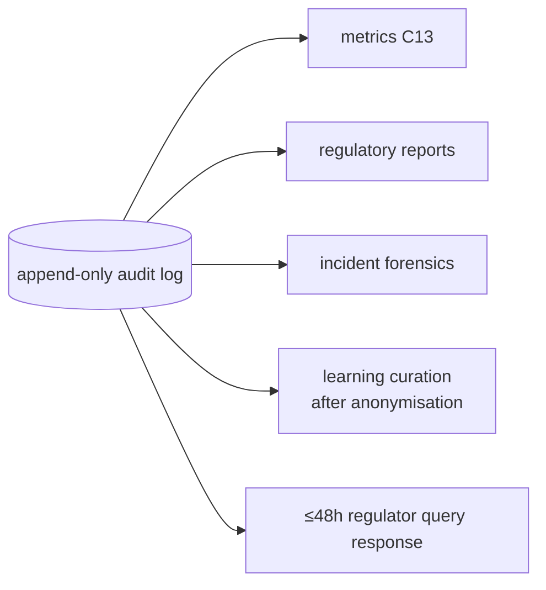

# Audit Logging & Data Retention — NexBank NEXA (C12)

Parent: [`README.md`](README.md) · Component: **C12** · Owner: Security + DPO + Compliance.

Every decision NEXA makes is traceable. Audit logging is what makes the system **explainable, auditable, and compliant** — it is the evidence base for the RBI Responsible-AI expectation ("explainable, auditable decisions"), the ≤48h regulator-query SLA, and incident response. The design tension is real: log *enough* to be fully accountable, while logging *no* raw sensitive data. We resolve it with mask-at-source.

---

## 1. What is logged (turn-level event)

Every turn emits one structured, append-only event:

```json
{
  "event_id": "evt_01J...",              // unique, sortable
  "session_id": "sess_...",              // per-conversation
  "customer_ref": "cust_token_...",      // tokenised, never raw id
  "timestamp": "2026-08-21T10:15:03.221+05:30",
  "channel": "app",
  "turn_index": 4,

  "input": {
    "text_masked": "what's my balance for card ending 5678",  // PII masked at source
    "detected_language": "en"
  },
  "nlu": {
    "intent": "ACC-001",
    "intent_confidence": 0.94,
    "entities": [{"type": "card_last4", "value": "5678"}]      // only last-4 ever
  },
  "state": {
    "dialogue_state": "RETRIEVING",
    "auth_level": "otp_verified",
    "escalation_proximity": 0.12,
    "sentiment": 0.1
  },
  "retrieval": {
    "kb_ids": ["KB-FAQ-003"],
    "scores": [0.81],
    "latency_ms": 138,
    "freshness_ok": true
  },
  "decision": {
    "action": "respond",
    "template_id": "T-FACT-BALANCE",
    "generated": false,                  // template path, not free LLM
    "blocked": false,
    "escalation": null,
    "flags": ["pii_masked"]
  },
  "safety": {
    "input_scan": "clean",               // C2 result
    "output_scan": "clean",              // C10 result
    "interventions": []
  },
  "versions": {
    "prompt_version": "sp-1.0",
    "policy_version": "pol-1.4",
    "model_version": "gen-2.1",
    "kb_snapshot": "kb-2026-08-01"
  },
  "latency_ms_total": 512
}
```

The `versions` block is critical: it lets any past response be reproduced and explains *which* configuration produced it (supports rollback and the learning pipeline's accountability chain).

---

## 2. PII handling in logs (mask-at-source)

| Data | In logs |
|---|---|
| Card / account / Aadhaar | last-4 only |
| CVV / PIN / password | **never** (redacted before write) |
| OTP | **never** (transient, redacted) |
| Full name / phone / email | tokenised |
| Message text | masked copy (numbers reduced to last-4, credentials redacted) |

Masking happens **before** the event is written, not after — a raw sensitive value never touches durable storage. This mirrors the production masking rules in [`../guardrails/account-security.md`](../guardrails/account-security.md), so training data derived from logs is already safe.

---

## 3. Integrity & access

- **Append-only + tamper-evident.** Events are write-once; each event carries a hash chained to the previous one, so any tampering is detectable (needed for regulator trust and dispute evidence).
- **Least-privilege access.** Log access is role-gated (Security, DPO, Compliance, ML-curation) and is *itself* logged — access to audit data is audited.
- **Segregation.** Operational metrics (aggregate) are separated from raw audit events (sensitive), so dashboards don't require access to individual transcripts.

---

## 4. Retention & deletion

| Data class | Retention | Basis |
|---|---|---|
| Transaction/interaction audit | per RBI record-keeping norms | banking regulation |
| Complaint/grievance records | as per Ombudsman scheme | regulatory |
| Security incident logs | extended (forensics) | security policy |
| Training-curation copies | minimal, purpose-limited | DPDP minimisation |
| Right-to-deletion requests | honoured within **30 days** | DPDP 2023 |

Deletion honours legal holds: records under an active dispute/investigation are retained until released, which is the lawful exception to the 30-day deletion right.

---

## 5. What the logs enable



- **Metrics/dashboards** ([`../metrics/README.md`](../metrics/README.md)) aggregate from these events.
- **Regulatory reports** ([`../guardrails/regulatory-compliance.md`](../guardrails/regulatory-compliance.md) §3) are built from them.
- **Incident response** ([`../guardrails/incident-response.md`](../guardrails/incident-response.md)) uses them for forensics and the accountability chain.
- **Learning** ([`../learning-pipeline/README.md`](../learning-pipeline/README.md)) curates from anonymised copies only.

---

## 6. Demo note

The reference demo prints a compact, masked decision trace per turn (intent, action, flags, escalation, template) to illustrate this schema without any real storage or PII — see `src/nexbank_agent/audit.py`.
