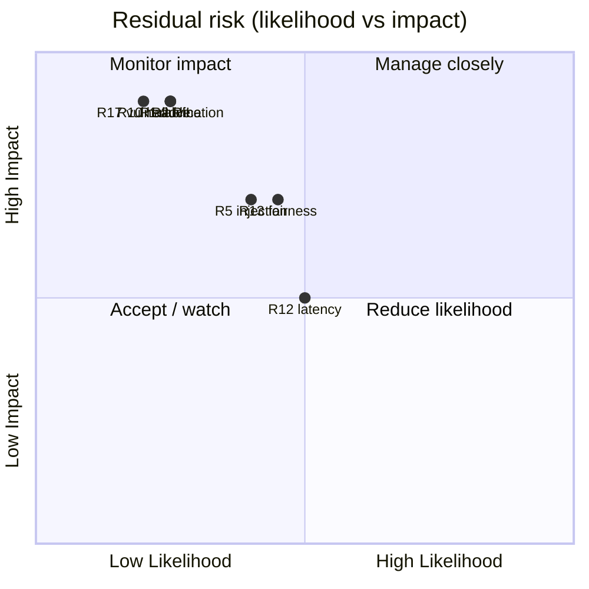

# Risk Assessment & Governance — NexBank NEXA

Parent: [`README.md`](README.md) · Framework: **NIST AI RMF 1.0** (Govern / Map / Measure / Manage) · Owner: Risk & Compliance.

A structured view of what can go wrong, how likely and how bad it would be, and the concrete control that reduces it. This is the "Risk Manager" competency evidence and the source of the accountability chain used in incident response.

---

## 1. Risk scoring

Likelihood × Impact, each 1 (low) – 5 (high). **Residual** is the level *after* the listed control is applied.

| Score | Band |
|---|---|
| 1–6 | Low |
| 7–12 | Medium |
| 13–19 | High |
| 20–25 | Critical |

---

## 2. Risk register

| # | Risk | L | I | Inherent | Primary control | Residual |
|---|---|---|---|---|---|---|
| R1 | **Incorrect/personalised financial advice** reaches a customer | 3 | 5 | 15 High | Immutable advice-block (C6) + advice tests (`GA-ADV-*`) + human audit + ESC-013 | **Low (4)** |
| R2 | **PII leak** (full card/Aadhaar/CVV in output or log) | 3 | 5 | 15 High | Mask-at-source (C12) + output filter (C10) + entity refusal + `GS-PII-*` | **Low (4)** |
| R3 | **Unauthorised action** (change/txn above auth level) | 2 | 5 | 10 Med | Auth ladder (C7) + state machine + `GS-AUTH-*` | **Low (4)** |
| R4 | **Cross-customer data exposure** | 2 | 5 | 10 Med | Session-scoped retrieval, no code path to other data + `GS-XCUST-*` | **Low (2)** |
| R5 | **Prompt injection / jailbreak** changes behaviour | 4 | 4 | 16 High | Instruction/data separation + C2 patterns + C6 independence + `AD-INJ/JAIL/EXFIL` | **Low (6)** |
| R6 | **Social engineering / impersonation** gains access | 3 | 5 | 15 High | Authority-claim detection + no privileged actions in channel + `GS-SE-*`/`AD-SPOOF-*` | **Low (5)** |
| R7 | **Money movement** initiated/claimed by agent | 2 | 5 | 10 Med | No transfer action exists; C6 vetoes claims + `GS-MONEY-*` | **Low (2)** |
| R8 | **Regulatory non-compliance** (missing disclosure, auto-loan decision, no grievance path) | 3 | 4 | 12 Med | Regulatory guardrails + KB disclosures + `GR-*` tests | **Low (5)** |
| R9 | **Stale regulatory facts** served as current | 3 | 4 | 12 Med | KB freshness TTL fail-closed → ESC-008 | **Low (4)** |
| R10 | **Hallucinated numbers** (wrong rate/fee/balance) | 3 | 5 | 15 High | Template-first + structured-fact-only + C10 groundedness check | **Low (4)** |
| R11 | **Model/behaviour drift** after learning | 3 | 4 | 12 Med | Safety gate 100% + canary + drift monitoring + auto-rollback | **Low (4)** |
| R12 | **Availability / latency** breach (outage, >3s) | 3 | 3 | 9 Med | Async logging, circuit breakers, graceful degradation, scaling | **Low (6)** |
| R13 | **Bias / unfair performance** (e.g. Hinglish worse) | 3 | 4 | 12 Med | Sliced metrics (language/channel), fairness watch (NIST measure) | **Med (8)** |
| R14 | **DoS / resource exhaustion** | 3 | 3 | 9 Med | Rate limiting, input length/complexity scoring, `AD-DOS-*` | **Low (5)** |
| R15 | **Data-governance breach** (consent, retention, deletion) | 2 | 5 | 10 Med | DPDP consent + minimisation + 30-day deletion + access controls | **Low (4)** |
| R16 | **Over-blocking** harms CX (false positives) | 3 | 3 | 9 Med | Corroborating-signal design + FP-rate monitoring; tune soft only | **Low (6)** |
| R17 | **Vulnerable-customer harm** (distress missed) | 2 | 5 | 10 Med | Crisis detection → ESC-003 P0, empathy-first | **Low (4)** |

Highest residual is R13 (fairness) — deliberately kept visible because it needs ongoing measurement rather than a one-time fix.

---

## 3. Risk heat map (residual)

---

## 4. NIST AI RMF mapping

- **Govern.** Roles and accountability chain defined (who designs, approves, reviews, operates each control); dual approval for immutable-rule changes; annual AI audit.
- **Map.** This register + the failure-mode table in [`README.md`](README.md) identify context and risks per component.
- **Measure.** The safety/quality metrics in [`../metrics/README.md`](../metrics/README.md) quantify each risk (incorrect-advice rate, FP rate, drift, sliced fairness).
- **Manage.** Guardrails, safety gate, canary/rollback, and the incident-response playbook actively reduce and respond to risk.

---

## 5. Accountability chain

For every safety-critical control there is a named accountable function:

| Concern | Accountable |
|---|---|
| Immutable safety rules (C6) | Risk & Compliance |
| Data protection / PII / retention | DPO |
| Adversarial / access security | Security Operations |
| Model versions & learning gate | ML Platform + RC sign-off |
| Regulatory reporting | Compliance |
| CX / escalation quality | CX Operations |

Each incident records which function owned the affected control (see [`../guardrails/incident-response.md`](../guardrails/incident-response.md)), closing the loop between risk, control, and ownership.

---

## 6. Residual-risk statement

With the controls above, all safety- and privacy-critical risks are reduced to **Low**. The residual posture depends on two ongoing commitments: the safety suite staying at 100% on every release, and active fairness measurement (R13). No control is assumed perfect — hence the defence-in-depth (C2 **and** C6 **and** C10) and the incident-response path for the event that one layer fails.
