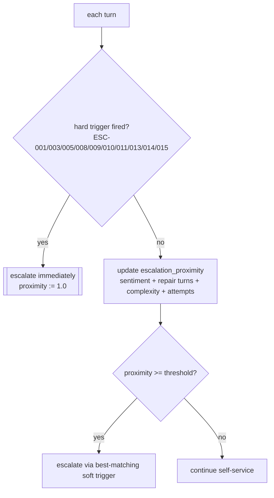

# Escalation & Human Handoff — NexBank NEXA (C11)

Parent: [`../architecture/README.md`](../architecture/README.md) · Component: **C11** · Owner: CX Operations + Risk & Compliance.

When and how NEXA hands a conversation to a human. Good escalation is a **feature, not a failure**: escalating the right conversations at the right moment is what protects the 4.5+ CSAT target and the 0% incorrect-advice target simultaneously. The design goal is *"escalate early on risk, escalate late on routine"*.

---

## 1. The 15 escalation triggers

Each trigger has a fixed **priority**, a **routing target**, an **SLA**, and a **hard/soft** flag. **Hard** triggers are immutable — no learned policy can suppress them (they live behind C6). **Soft** triggers are tunable by the learning pipeline within bounds.

| ID | Trigger | Category | Priority | Route to | SLA (first human touch) | Hard? |
|---|---|---|---|---|---|---|
| **ESC-001** | Fraud / unauthorised transactions / stolen card / account takeover | Security | **P0** | Fraud & Security Ops | Immediate (<30s) | **Hard** |
| **ESC-002** | Disputed/failed transaction with unresolved debit | Financial | P1 | Disputes team | <5 min | Soft |
| **ESC-003** | Customer distress / vulnerability / crisis signals | Duty-of-care | **P0** | Senior care agent + crisis protocol | Immediate | **Hard** |
| **ESC-004** | Repeated NLU failure (low confidence after 2 clarifications) | Capability | P2 | General human agent | <15 min | Soft |
| **ESC-005** | Explicit request for a human ("talk to a person") | Customer right | P2 | General human agent | <10 min | **Hard** |
| **ESC-006** | Complex/high-value account action beyond agent scope (e.g. account closure) | Service | P1 | Relationship manager | <10 min | Soft |
| **ESC-007** | Sustained negative sentiment / frustration threshold crossed | Experience | P1 | Senior agent / retention | <5 min | Soft |
| **ESC-008** | KB freshness fail-closed (regulatory figure past TTL) | Safety | P1 | Human agent + Content Ops | <10 min | **Hard** |
| **ESC-009** | Repeated adversarial / abuse attempts (attack counter) | Security | P1 | Security Ops | <10 min | **Hard** |
| **ESC-010** | Formal complaint / grievance filing (Ombudsman path) | Regulatory | P1 | Grievance / Nodal Officer | <5 min | **Hard** |
| **ESC-011** | Legal / regulator / law-enforcement request | Regulatory | P1 | Legal & Compliance | <15 min | **Hard** |
| **ESC-012** | Technical failure / downstream outage / retrieval error | Reliability | P2 | Tech support (fallback flow) | <15 min | Soft |
| **ESC-013** | Personalised investment/insurance advice requested | Advice boundary | P1 | SEBI-registered advisor / IRDAI-compliant desk | <30 min (or scheduled) | **Hard** |
| **ESC-014** | Loan / credit decision requested | Regulatory | P1 | Human underwriting / loan team | <30 min (or scheduled) | **Hard** |
| **ESC-015** | PEP / AML enhanced due diligence | Compliance | P1 | AML / Compliance team | <15 min | **Hard** |

10 of 15 are **hard** — the safety-, rights-, and regulation-driven ones. Only capability/experience/reliability triggers are tunable.

---

## 2. How the decision is made

Escalation is driven by an **`escalation_proximity`** score in `[0,1]` maintained in dialogue state (formula in [`../architecture/README.md`](../architecture/README.md)). Two ways to escalate:

- **Hard triggers short-circuit everything** — they fire on the turn they are detected, regardless of score, and cannot be suppressed by the learning pipeline.
- **Soft triggers accumulate**: frustration, repeated repairs, rising complexity, and low confidence each push `escalation_proximity` up until it crosses the (tunable) threshold.
- **Priority ordering**: if several triggers match, the highest priority wins (P0 > P1 > P2); ties break to the more specific/hard trigger.

---

## 3. Context handoff package

No customer should have to repeat themselves. On escalation, C11 assembles a **handoff package** for the human agent:

| Field | Contents |
|---|---|
| Summary | one-paragraph NEXA-generated synopsis of the issue |
| Intent & entities | classified intent(s), extracted/validated slots |
| Trigger | which ESC-id fired and why (score or hard reason) |
| Auth state | verified level (never raw credentials) |
| Sentiment trajectory | start→current sentiment, frustration markers |
| Transcript | full masked conversation (PII already masked) |
| Suggested next step | what NEXA believes the customer needs |
| SLA clock | priority + deadline for first human touch |

This package satisfies the "seamless handoff" requirement and is itself logged (C12) for audit.

---

## 4. Warm vs cold, and no dead-ends

- **Warm handoff (default for P0/P1).** NEXA tells the customer what will happen, sets expectations ("connecting you to our fraud team now — your case reference is …"), and stays with them until the human is on.
- **Scheduled handoff (ESC-013/014).** For advice/loan routing where a human isn't instantly available, NEXA offers a booked slot rather than a dead-end.
- **No silent drops.** Even ESC-012 (technical failure) returns a graceful fallback with a reference id and a callback path — never a "something went wrong" wall.

---

## 5. Availability & fallback

| Situation | Behaviour |
|---|---|
| Agents available | route per SLA, warm transfer |
| Queue full / after-hours | P0 always staffed (fraud/crisis); P1/P2 offered callback or async ticket with reference id |
| Downstream escalation system down | circuit breaker → create durable ticket, promise callback, log incident |
| Customer declines handoff | respect choice, offer self-service + ticket, keep the door open |

P0 lanes (ESC-001 fraud, ESC-003 crisis) are **always** reachable, 24×7 — they are never gated behind a queue.

---

## 6. Anti-patterns explicitly avoided

- **Escalation ping-pong** — once escalated, ownership stays human; NEXA does not re-absorb a P0/P1 case.
- **Premature escalation** — a single low-confidence turn does not escalate; the threshold requires corroboration (protects containment ≥70%).
- **Escalation as a dumping ground** — the handoff package forces NEXA to summarise, so humans receive context, not raw chaos.
- **Authentication theatre before a P0** — for fraud/crisis, help first; identity is confirmed in parallel, not as a blocker.

---

## 7. Metrics

Tracked on the ops dashboard ([`../metrics/`](../metrics/)): escalation rate overall and per trigger, false-escalation rate (escalated but resolvable), P0 time-to-human, post-handoff CSAT, re-escalation rate, and containment (1 − escalation rate on eligible intents). Target: high precision on soft triggers, 100% recall on hard triggers.
