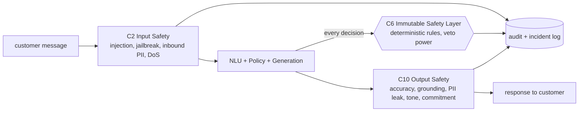

# Guardrail & Safety Specification — NexBank NEXA

**Deliverable:** L4 (Guardrails & Safety) — highest-weighted level (180 pts / 18%).
**Companion docs:** [`financial-advice.md`](financial-advice.md) · [`account-security.md`](account-security.md) · [`regulatory-compliance.md`](regulatory-compliance.md) · [`adversarial-robustness.md`](adversarial-robustness.md) · [`incident-response.md`](incident-response.md)
**Test cases:** [`../../tests/`](../../tests/) (62 cases) · **Runtime enforcement:** Immutable Safety Layer (C6) + Input Safety (C2) + Output Safety (C10).

This is the safety contract for NEXA. Its central design commitment: **safety is deterministic and un-learnable.** The learning pipeline (C14) may improve tone, ranking, and phrasing, but it can never weaken any rule in this specification.

---

## 1. Guardrail architecture

Three enforcement points, defence-in-depth:

| Layer | Guards against | Type |
|---|---|---|
| **C2 Input Safety** | Prompt injection, jailbreaks, inbound sensitive PII, DoS/abuse | Rule + model, pre-reasoning |
| **C6 Immutable Safety** | Prohibited actions, auth violations, advice, cross-customer leakage | **Rule-based, immutable** |
| **C10 Output Safety** | Hallucinated figures, PII leaks, wrong tone, unfulfillable promises | Rule + model, post-generation |

**Guardrail categories** (each detailed in its own doc):
1. Financial-advice guardrails → [`financial-advice.md`](financial-advice.md)
2. Account-security guardrails (8 mandatory rules) → [`account-security.md`](account-security.md)
3. Regulatory-compliance guardrails (RBI/PCI/KYC-AML/SEBI/IRDAI/DPDP) → [`regulatory-compliance.md`](regulatory-compliance.md)
4. Adversarial robustness (6 attack vectors) → [`adversarial-robustness.md`](adversarial-robustness.md)

---

## 2. Implementation strategy (per guardrail type)

The right technique differs by guardrail. A model alone is too soft for hard safety; rules alone are too brittle for language. NEXA layers them, with a **deterministic final gate** for anything safety-critical.

| Guardrail | Detection | Final decision | Why |
|---|---|---|---|
| Personalised financial advice | lexical trigger → intent (PRD-005) → LLM classifier | **rule-based block** | Zero-tolerance target; a probabilistic gate can't be the last word |
| PII in output (full card/Aadhaar/CVV) | regex + entity tags | **rule-based redact/block** | Deterministic, testable, PCI/KYC-mandated |
| Prompt injection | pattern set + classifier | rule-based neutralise (ignore instructions, resume flow) | Must act pre-reasoning |
| Auth-gated action | auth-level check | rule-based (allow/step-up) | Binary and non-negotiable |
| Hallucinated figure | grounding check vs retrieved `structured` | rule-based block/repair | Numbers must match KB exactly |
| Tone / empathy | classifier | soft (re-generate, non-blocking) | Quality, not safety — LLM-appropriate |
| Commitment / false promise | pattern + classifier | rule-based rephrase | Prevents "False Confidence" auto-fail |

**Immutability mechanism.** C6 rules live in a signed, version-controlled policy bundle. The learning pipeline has **no write path** to it (enforced architecturally, see `../learning-pipeline/README.md` §safety-invariant). Changes require Risk Committee approval and re-signing.

---

## 3. False-positive analysis

Over-blocking harms CX (target: guardrail false-positive rate **< 3%**). Expected rates and mitigations:

| Guardrail | Expected FP rate | Cause of false positives | Mitigation |
|---|---|---|---|
| Financial advice | ~2–4% | Factual rate questions phrased personally ("what's the FD rate *for me*") | Require corroborating advice signal (2nd-person modal + personal fact) before blocking; otherwise answer factually |
| Prompt injection | ~1–2% | Legitimate use of words like "ignore"/"system" | Require instruction-shaped pattern, not keyword alone |
| PII output block | <1% | Masked last-4 mistaken for full | Validate against known-safe masked formats first |
| Commitment detection | ~2–3% | Legitimate factual timelines ("auto-reverses in 48h per RBI") | Allow figures that are grounded in KB; block only ungrounded promises |
| Tone (soft) | n/a (non-blocking) | — | Re-generation, never a hard block |

**Tuning loop.** False positives are logged, sampled by supervisors, and fed to threshold tuning in the learning pipeline — but only *soft* thresholds move; hard rules don't. Overall strictness is `guardrail_strictness_level = HIGH` (`../../config/configuration-parameters.md`), changeable only with RC approval.

---

## 4. Guardrail monitoring dashboard (spec)

Surfaced in the Real-Time Operations dashboard (`../metrics/`):

- **Trigger heat map** — guardrail id × intent, counts over rolling 1h/24h. Highlights which boundaries fire most.
- **Breach panel** — any C6 rule that was *bypassed* (should always be zero); a non-zero value is a P0 incident.
- **False-positive tracker** — safe responses blocked (sampled + labelled), trended against the <3% target.
- **Adversarial feed** — live injection/social-engineering attempts with disposition (neutralised/escalated).
- **New-attack anomaly alert** — spike detection on attack categories (e.g. sudden injection surge).

Metrics emitted per turn: `guardrails_checked`, `guardrails_triggered`, `guardrail_outcome` (allow/repair/block/escalate) → C12 audit log (`../architecture/audit-logging.md`).

---

## 5. Coverage summary

| Requirement | Where | Count |
|---|---|---|
| Financial-advice info-vs-advice matrix | `financial-advice.md` | 6 categories + rules |
| Mandatory account-security rules | `account-security.md` | 8 rules |
| Regulatory mapping | `regulatory-compliance.md` | 12 frameworks |
| Adversarial attack vectors + defences | `adversarial-robustness.md` | 6 vectors |
| Adversarial/safety test cases | `../../tests/` | **62** (>50) |
| Incident-response playbook | `incident-response.md` | 6 breach classes |

---

### Cross-references
- Tests that validate these rules: [`../../tests/README.md`](../../tests/README.md)
- Runtime layers (C2/C6/C10): [`../architecture/README.md`](../architecture/README.md)
- Immutable-safety guarantee in learning: [`../learning-pipeline/README.md`](../learning-pipeline/README.md)
