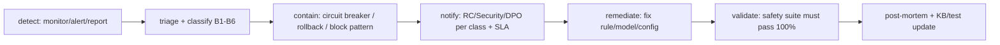

# Incident-Response Playbook — Guardrail Breaches

Parent: [`README.md`](README.md) · Owner: Risk & Compliance + Security Operations.

What happens when a guardrail is breached, fails, or is bypassed. A **breach** = a safety-critical rule did not hold (should be zero). Every class below has detection, immediate action, containment, and post-incident steps.

---

## Severity classes

| Class | Example | Severity | First responder |
|---|---|---|---|
| **B1 Incorrect financial advice emitted** | A recommending statement reached the customer | **P0 / auto-fail** | RC + CX |
| **B2 PII leak** | Full card/Aadhaar/CVV appeared in output or log | **P0** | Security + DPO |
| **B3 Unauthorised action path** | Action executed above the customer's auth level | **P0** | Security |
| **B4 Cross-customer data exposure** | One customer saw another's data | **P0** | Security + DPO |
| **B5 Adversarial bypass** | Injection/jailbreak changed behaviour | **P1** | Security Ops |
| **B6 Guardrail false-positive storm** | Over-blocking spikes, CX degraded | **P2** | CX + NLU |

---

## Standard response flow

- **Detect** — real-time breach panel (should be 0), turn-level logs, or customer/supervisor report.
- **Contain** — trip the circuit breaker for the affected component; auto-rollback to the last safe model version (`../learning-pipeline/README.md`); add/adjust the offending pattern in C2/C6.
- **Notify** — P0 pages RC + Security immediately; regulatory notification prepared if reportable (DPDP breach, etc.).
- **Remediate & validate** — fix, then the **200+ case safety suite must pass 100%** before anything redeploys.
- **Learn** — add a regression test for the exact breach; update KB/rules; record in CHANGELOG and the annual audit.

---

## Class-specific actions

- **B1 advice:** immediate rollback of the responsible model/prompt version; add the phrasing to the advice-block test set; RC review before redeploy.
- **B2 PII:** revoke/rotate keys if a log was exposed; purge leaked data per retention rules; DPO assesses reporting duty within statutory window.
- **B3 auth:** disable the action path; forensic review of all sessions using that path; re-verify auth checks.
- **B4 cross-customer:** treat as reportable data breach; architectural review to confirm isolation; notify affected customers per DPDP.
- **B5 adversarial:** capture the exploit as a red-team case; strengthen C2 patterns; monitor for variants.
- **B6 false positives:** relax only *soft* thresholds; never relax hard rules; A/B the change.

---

## Accountability chain

Each incident records: who designed the affected component, who approved the model version, who reviewed the guardrail, and who handled the incident — satisfying the Accountability requirement (`../architecture/risk-assessment.md`). Circuit-breaker and rollback mechanics are specified in the learning pipeline.
