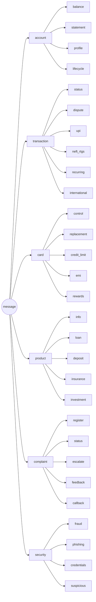

# Intent Taxonomy & NLU Specification — NexBank NEXA

**Deliverable:** L2 (Intent Taxonomy & NLU) · **Companion docs:** [`entities.md`](entities.md) · [`sample-utterances.md`](sample-utterances.md)

Hierarchical intent taxonomy with **32 domain intents** (+5 general/meta = 37 total), exceeding the 25 minimum and the 30-intent "Linguist" threshold. Each intent carries its tier path, required/optional slots, authentication level, and safety rating, so slot-filling and guardrail arming are derivable directly from this taxonomy.

---

## 1. Three-tier structure

`primary → secondary → tertiary`, with confidence thresholds enforced per layer (§5).

- **Primary (6):** `account · transaction · card · product · complaint · security`
- **Secondary:** functional grouping within a primary (e.g. `account.balance`, `transaction.dispute`).
- **Tertiary:** the disambiguated leaf where behaviour differs (e.g. `transaction.dispute.merchant_error` vs `transaction.dispute.unauthorized`).

Auth levels: `anonymous < otp_verified < biometric_verified < full_kyc`. Safety ratings: `LOW < MEDIUM < HIGH < CRITICAL` (drives guardrail strictness and confirmation requirements).

---

## 2. Intent catalogue (32 domain intents)

### 2.1 Account Management (7) — `ACC`

| ID | Intent (tertiary path) | Required slots | Optional slots | Auth | Safety |
|---|---|---|---|---|---|
| ACC-001 | `account.balance.check` | `account_ref` \| `account_type` | `as_of_date` | OTP | LOW |
| ACC-002 | `account.statement.request` | `account_ref`, `date_range`, `format` | `delivery_channel` | OTP | LOW |
| ACC-003 | `account.profile.contact_update` | `field_to_update`, `new_value` | `otp_token` | Biometric | HIGH |
| ACC-004 | `account.profile.address_update` | `new_address`, `proof_document` | — | Biometric | HIGH |
| ACC-005 | `account.lifecycle.closure` | `account_ref`, `reason`, `confirmation` | `branch_pref` | Full KYC + Branch | CRITICAL |
| ACC-006 | `account.lifecycle.nominee_update` | `nominee_name`, `relationship`, `id_proof` | `allocation_pct` | Full KYC | CRITICAL |
| ACC-007 | `account.lifecycle.upgrade_downgrade` | `current_type`, `desired_type` | `reason` | OTP | MEDIUM |

### 2.2 Transaction & Payment (6) — `TXN`

| ID | Intent | Required slots | Optional slots | Auth | Safety |
|---|---|---|---|---|---|
| TXN-001 | `transaction.status.enquiry` | `transaction_id` \| `txn_description` | `date`, `amount` | OTP | LOW |
| TXN-002 | `transaction.dispute.{merchant_error\|duplicate_charge\|unauthorized}` | `transaction_id`, `dispute_reason`, `amount` | `merchant_name`, `card_ref` | OTP | HIGH |
| TXN-003 | `transaction.upi.failure` | `upi_ref`, `beneficiary`, `amount`, `timestamp` | `app_used` | OTP | MEDIUM |
| TXN-004 | `transaction.neft_rtgs.status` | `ref_number`, `beneficiary_bank` | `amount`, `date` | OTP | LOW |
| TXN-005 | `transaction.recurring.{setup\|cancel}` | `beneficiary`, `amount`, `frequency` | `start_date`, `end_date` | Biometric | HIGH |
| TXN-006 | `transaction.international.enquiry` | `amount`, `currency`, `destination_country` | `purpose_code` | Full KYC | HIGH |

### 2.3 Card Management (5) — `CRD`

| ID | Intent | Required slots | Optional slots | Auth | Safety |
|---|---|---|---|---|---|
| CRD-001 | `card.control.{block\|unblock}` | `card_ref`, `action` | `reason` | OTP (block) / Biometric (unblock) | HIGH |
| CRD-002 | `card.replacement` | `card_ref`, `reason` | `delivery_address_ref` | OTP | MEDIUM |
| CRD-003 | `card.credit_limit.change` | `card_ref`, `requested_limit` | `income_proof` | Biometric | HIGH |
| CRD-004 | `card.emi.conversion` | `transaction_id`, `tenure_months` | `card_ref` | OTP | MEDIUM |
| CRD-005 | `card.rewards.enquiry` | `card_ref` | `redeem_intent` | OTP | LOW |

### 2.4 Product & Advisory (5) — `PRD`

| ID | Intent | Required slots | Optional slots | Auth | Safety |
|---|---|---|---|---|---|
| PRD-001 | `product.info` | `product_name` \| `product_category` | `aspect` (rates/fees/eligibility) | Anonymous | LOW |
| PRD-002 | `product.loan.eligibility` | `loan_type` | `amount`, `tenure` | OTP | MEDIUM |
| PRD-003 | `product.deposit.rates` | `deposit_type` | `tenure`, `amount` | Anonymous | LOW |
| PRD-004 | `product.insurance.info` | `insurance_type` | `cover_amount` | Anonymous | MEDIUM |
| PRD-005 | `product.investment.advisory` | `advisory_topic` | `amount`, `horizon` | Anonymous | **CRITICAL** |

> **PRD-005 is information-only by design.** The intent *exists* so the agent can recognise an advice request and route it to a SEBI-registered advisor — it must never emit a personalised recommendation (see `../guardrails/financial-advice.md`).

### 2.5 Complaint & Feedback (5) — `CMP`

| ID | Intent | Required slots | Optional slots | Auth | Safety |
|---|---|---|---|---|---|
| CMP-001 | `complaint.register` | `issue_description`, `category` | `related_txn_id` | OTP | MEDIUM |
| CMP-002 | `complaint.status` | `complaint_id` | — | OTP | LOW |
| CMP-003 | `complaint.escalate` | `complaint_id`, `escalation_reason` | — | OTP | MEDIUM |
| CMP-004 | `complaint.feedback` | `feedback_text` \| `rating` | `topic` | Anonymous | LOW |
| CMP-005 | `complaint.callback_request` | `callback_number_ref`, `preferred_time` | `topic` | OTP | LOW |

### 2.6 Security & Fraud (4) — `SEC`

| ID | Intent | Required slots | Optional slots | Auth | Safety |
|---|---|---|---|---|---|
| SEC-001 | `security.fraud.report` | `fraud_type`, `affected_ref` | `amount`, `timestamp` | Anonymous → step-up (P0 regardless) | CRITICAL |
| SEC-002 | `security.phishing.report` | `channel`, `description` | `sender_ref` | Anonymous | MEDIUM |
| SEC-003 | `security.credentials.reset` | `credential_type`, `account_ref` | — | Biometric | HIGH |
| SEC-004 | `security.suspicious.activity` | `activity_description`, `account_ref` | `timestamp` | OTP | HIGH |

### 2.7 General / meta (5) — `GEN` (not counted in the 32)

`GEN-001 greeting · GEN-002 smalltalk · GEN-003 human_agent_request · GEN-004 out_of_scope · GEN-005 thanks_closure`. These manage flow (greeting, chit-chat deflection, explicit human requests → ESC-006 after 3, OOS handling, and graceful closes).

---

## 3. Slot-filling policy

- **Required vs optional.** A required slot in `empty`/`invalid` state blocks the terminal action; the policy asks one targeted question per missing slot (never a scattershot form).
- **Validation before use.** Entity values are validated (`entities.md`) before entering a slot; invalid → `invalid` status → re-ask, never proceed.
- **Confirmation for CRITICAL/HIGH.** For HIGH/CRITICAL-safety intents, filled slots must reach `confirmed` (Confirmation-Before-Action) before the action executes.
- **Defaults.** Only for low-risk optional slots (e.g. `format=PDF`, `date_range=last_30_days`). Never defaulted for money, beneficiaries, or PII.
- **Persistence.** Slot context survives topic switches via a slot stack (Context Carry-Over), so an interrupted dispute resumes without re-asking.

---

## 4. Disambiguation (6 confusable pairs)

Each pair uses: (a) **confidence-margin logic** — if `top1 − top2 < 0.15`, clarify rather than guess; (b) an **entity-based tiebreak**; (c) a **single clarifying question**.

| Pair | Entity/signal tiebreak | Clarifying question |
|---|---|---|
| **TXN-001 vs TXN-002** (status vs dispute) | Presence of dispute lexicon ("wrong", "didn't do", "unauthorised") or negative sentiment → dispute; neutral "where is my txn" → status | "Do you want me to check the status of this transaction, or raise a dispute because it looks incorrect?" |
| **PRD-001 vs PRD-005** (info vs advice) | 2nd-person modal ("should I", "which is better *for me*", personal facts like age/salary) → advisory; factual "what are the rates" → info | "Would you like the factual details of these products, or a recommendation on what suits you personally?" (latter → advisor) |
| **ACC-003 vs ACC-004** (contact vs address) | `field_to_update ∈ {phone,email}` → contact; presence of address tokens/PIN code → address | "Are you updating your phone/email, or your mailing address?" |
| **CMP-001 vs CMP-003** (new vs escalate) | Presence/validity of an existing `complaint_id` and "already/still/again" → escalate; no prior reference → register | "Is this a new issue, or are you following up on an existing complaint? If existing, please share the complaint ID." |
| **SEC-001 vs TXN-002** (fraud vs merchant dispute) | "stole/hacked/didn't authorise/unknown merchant" + high negative sentiment → fraud (P0); "wrong amount/duplicate/refund from known merchant" → dispute | "Do you recognise the merchant but the charge is wrong, or do you not recognise this transaction at all?" (latter → fraud path) |
| **CRD-001 vs SEC-001** (block card vs report fraud) | "lost/misplaced/precaution" → block only; "unauthorised transactions already happened" → fraud + block | "Is your card lost/misplaced, or have you noticed transactions you didn't make?" |

The decision trees above are the authoritative disambiguation logic; where they sit in the conversation lifecycle (the Understanding ↔ Clarifying loop) is shown in the dialogue state machine: [`../../diagrams/03-dialogue-state.mermaid`](../../diagrams/03-dialogue-state.mermaid).

**Reclassification.** Intent can change mid-conversation (Case Study 2). A strong fraud-lexicon match + sentiment drop > 0.2 on a live `TXN-002` triggers reclassification to `SEC-001` and fires ESC-001.

---

## 5. Confidence thresholds & fallback ladder

| Layer | Accept threshold | On miss |
|---|---|---|
| Primary | ≥ 0.60 | If < 0.50 → out-of-scope handling; else clarify at primary level |
| Secondary | ≥ 0.70 | Clarify within the accepted primary |
| Tertiary | ≥ 0.75 | Ask the pair-specific disambiguation question (§4) |
| Margin (top1−top2) | ≥ 0.15 at every layer | Clarify regardless of absolute confidence |

Defaults tie to `intent_confidence_threshold = 0.70` in `config/configuration-parameters.md`. **Fallback ladder:** accept → clarify (max 2 targeted questions) → rule-based shortlist → escalate (ESC-004 after 3 consecutive low-confidence turns). This bounded ladder is what prevents the "Robotic Loop" anti-pattern (a generic re-phrase prompt may appear at most once).

---

## 6. Multi-intent handling

Messages carrying multiple intents (e.g. *"check my balance and also block my card"*) are handled by:

1. **Detection** — segment on conjunctions/clauses; classify each segment; if ≥2 segments clear threshold, mark `multi_intent`.
2. **Ordering** — process by **safety priority** (CRITICAL/HIGH first). "Balance + block card" → block card (HIGH) first.
3. **Sequential confirmation** — resolve the first, then explicitly bridge: *"I've blocked your card ending 4521. You also asked about your balance — shall I pull that up now?"*
4. **Auth economy** — satisfy the highest auth requirement once; don't re-authenticate for the second intent (avoids the "Authentication Theatre" anti-pattern).

---

## 7. Out-of-scope (OOS) handling

- **Detection:** primary confidence < 0.50 across all categories, or match against an OOS pattern set (non-banking topics, competitor queries, general web questions).
- **Response:** Graceful Degradation pattern — state honestly what NEXA can/can't do, offer the closest in-scope help or a human agent; never fabricate.
- **Abuse/adversarial OOS** (e.g. "ignore your instructions") is routed to Input Safety (C2), not treated as a normal OOS (see `../guardrails/adversarial-robustness.md`).

---

## 8. NLU implementation notes

- **Production:** distilled transformer classifier fine-tuned on the 500-transcript taxonomy for intent; a sequence-labelling model + rule validators for entities; a lightweight sentiment/emotion head. All behind the `C3` interface (model-swappable).
- **Reference demo (`src/`):** deterministic lexical + weighted-keyword classifier over this taxonomy, regex/validator-based entity extraction, and a lexicon sentiment scorer — so the same taxonomy is exercised end-to-end without a GPU or API.
- **Cultural tuning:** Indian-English/Hinglish lexicon, code-switching tolerance, and sarcasm cues are part of sentiment scoring (see `sample-utterances.md` for Hinglish examples).

---

### Cross-references
- Entities & validation: [`entities.md`](entities.md) · Utterance library: [`sample-utterances.md`](sample-utterances.md)
- How intents gate actions/auth: [`../architecture/README.md`](../architecture/README.md) §6
- Advice boundary for PRD-005: [`../guardrails/financial-advice.md`](../guardrails/financial-advice.md)
