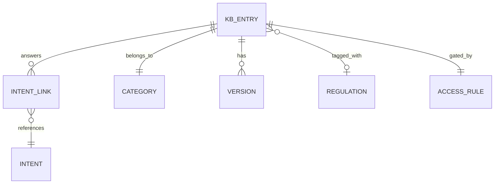
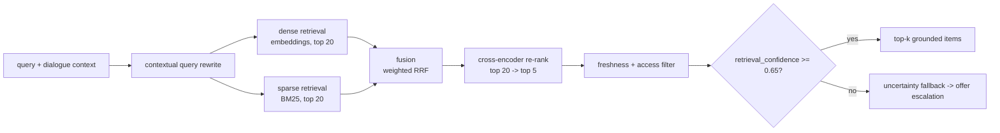
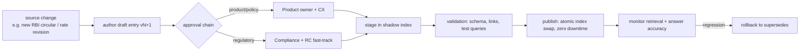

# Knowledge Base & Retrieval — NexBank NEXA

**Deliverable:** L3 (Knowledge Base & Retrieval) · **Companion:** [`sample-entries.md`](sample-entries.md) · data file: [`../../src/data/knowledge_base.json`](../../src/data/knowledge_base.json)

Design of the versioned knowledge base and the hybrid retrieval pipeline that serves grounded, freshness-checked facts to Response Generation (C9) at **sub-200ms p95**. Every financial figure NEXA states comes from here — never from the LLM's parametric memory.

---

## 1. Knowledge categories

| Category | Contents | Representation | Typical TTL |
|---|---|---|---|
| `product` | Product features, rates, fees, eligibility | Structured KV + NL passage | 7 days (rates), 90 days (features) |
| `policy` | Bank policies (zero-liability, refund timelines, charges) | Semi-structured + NL | 90 days |
| `regulatory` | RBI/SEBI/PCI/KYC rules relevant to answers | NL passage + compliance metadata | 30 days (fast-track on circular) |
| `faq` | Common how-tos and definitions | Q/A pairs | 180 days |
| `troubleshooting` | Step-by-step fixes (UPI failure, card not working) | Ordered steps | 180 days |
| `escalation` | When/where to hand off, grievance redressal | NL + routing metadata | 90 days |

---

## 2. KB entry schema (ER model)

Each entry is a document with structured metadata. Full instances in `../../src/data/knowledge_base.json`.

```yaml
KBEntry:
  id: string                     # e.g. KB-PRD-014
  category: enum[product, policy, regulatory, faq, troubleshooting, escalation]
  title: string
  body: string                   # authoritative answer text (may contain {slots})
  structured: {key: value}       # machine-usable facts (rate, fee, tenure...) for template rendering
  keywords: [string]             # sparse-retrieval anchors (product names, IFSC, "section 80c")
  related_intents: [string]      # intent ids this entry can answer
  # --- governance ---
  version: string                # semver; every edit bumps
  effective_from: date
  freshness_ttl_days: int        # → expiry = effective_from + ttl
  regulatory_tag: string | null  # e.g. "RBI-DLG-2022", "SEBI-ROBO-2024"; null if non-regulatory
  authority_source: string       # where the fact is sourced/verified
  min_auth_level: enum[anonymous, otp_verified, biometric_verified, full_kyc]
  sensitivity: enum[public, internal, restricted]
  approved_by: string            # approval chain reference
  supersedes: string | null      # prior version id (for rollback)
```

**Entity–relationship view.**


**Why structured + body together.** The `body` is what a human reads; `structured` is what C9's *template* path renders (e.g. `FD 1-year = 6.5%`). Facts like rates live in `structured` so a number is never paraphrased by the LLM — this is the mechanism behind the 0% incorrect-advice target.

---

## 3. Retrieval pipeline (hybrid, sub-200ms p95)



**Stages & budget (p95).**

| Stage | Method | Budget |
|---|---|---|
| Contextual query rewrite | Expand pronouns from dialogue state; add intent + product entities to the query | 10 ms |
| Dense retrieval | Embedding similarity, top-20 | 45 ms |
| Sparse retrieval | BM25 over `keywords`+`body`, top-20 | 25 ms |
| Fusion | Weighted Reciprocal Rank Fusion, `w_dense=0.6, w_sparse=0.4` | 5 ms |
| Cross-encoder re-rank | Re-score top-20 pairs, keep top-5 | 40 ms |
| Freshness + access filter | Drop expired (`ttl_ok=false`) and above-auth entries | 10 ms |
| Confidence scoring | Calibrated score of top item vs threshold | 5 ms |
| **Total** | | **~140 ms** (headroom under the 200ms cap) |

**Fusion rationale.** Banking queries mix exact tokens (IFSC `HDFC0001234`, "Section 80C", "NexHome Loan") with paraphrase ("money didn't reach"). BM25 nails exact tokens; embeddings catch paraphrase. RRF is robust to score-scale differences between the two retrievers; weights are A/B-tunable (`config/configuration-parameters.md`, `knowledge_retrieval_top_k`, `retrieval_confidence_threshold`).

**Confidence & uncertainty.** If the top re-ranked score < `retrieval_confidence_threshold (0.65)`, NEXA does **not** answer from a weak match; it acknowledges uncertainty and offers escalation (ESC-008 for regulatory). This is the "graceful fallback when no relevant knowledge is found" requirement and blocks hallucination at the retrieval boundary.

**Freshness fail-closed.** An entry whose `regulatory_tag` is set and whose TTL has expired is treated as **unavailable** — C9 cannot render its figure and must escalate to Compliance Helpdesk. Stale non-regulatory entries degrade to "let me confirm the latest and get back to you."

---

## 4. Knowledge maintenance workflow



- **Zero-downtime updates:** new versions land in a shadow index, validated, then atomically swapped — live conversations never see a half-updated KB.
- **Regulatory fast-track:** `regulatory` entries skip the standard queue via a Compliance+RC fast-track (mirrors the P0 "KB staleness" risk mitigation in `../architecture/risk-assessment.md`).
- **Rollback:** every entry keeps `supersedes`, so a bad update reverts by re-pointing the index to the prior version.
- **Staleness alerts:** a daily job flags entries within 7 days of TTL expiry; regulatory entries alert at 14 days.

---

## 5. Access control matrix (by auth level)

Retrieval filters candidates by `min_auth_level` **before** returning them, so knowledge is never leaked above the customer's verified level.

| Category / example | anonymous | otp_verified | biometric | full_kyc |
|---|:--:|:--:|:--:|:--:|
| Public product info, rates, FAQs | ✅ | ✅ | ✅ | ✅ |
| Account-specific policy (e.g. your charges) | ❌ | ✅ | ✅ | ✅ |
| Card control procedures | ❌ | ✅ | ✅ | ✅ |
| Nominee / closure procedures | ❌ | ❌ | ❌ | ✅ |
| Internal escalation routing notes | ❌ | ❌ | ❌ | ❌ (staff-only) |

Account *data* (balances, transactions) is **never** in the KB — it comes from backend systems through authenticated calls. The KB holds only *knowledge* (how things work, rates, policies, rules).

---

## 6. Coverage

61 seed entries span all six categories and every intent group, giving ≥90% coverage of the 10 interaction categories in the data package (KB-coverage target in `../metrics/`). Entries and their intent links are catalogued in [`sample-entries.md`](sample-entries.md); the machine-readable set the demo loads is [`../../src/data/knowledge_base.json`](../../src/data/knowledge_base.json).

---

### Cross-references
- How C9 renders `structured` facts via templates: [`../../config/prompt-templates.md`](../../config/prompt-templates.md)
- Retrieval config knobs: [`../../config/configuration-parameters.md`](../../config/configuration-parameters.md)
- Uncertainty → escalation: [`../escalation/README.md`](../escalation/README.md)
