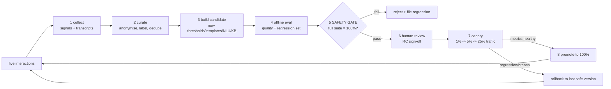
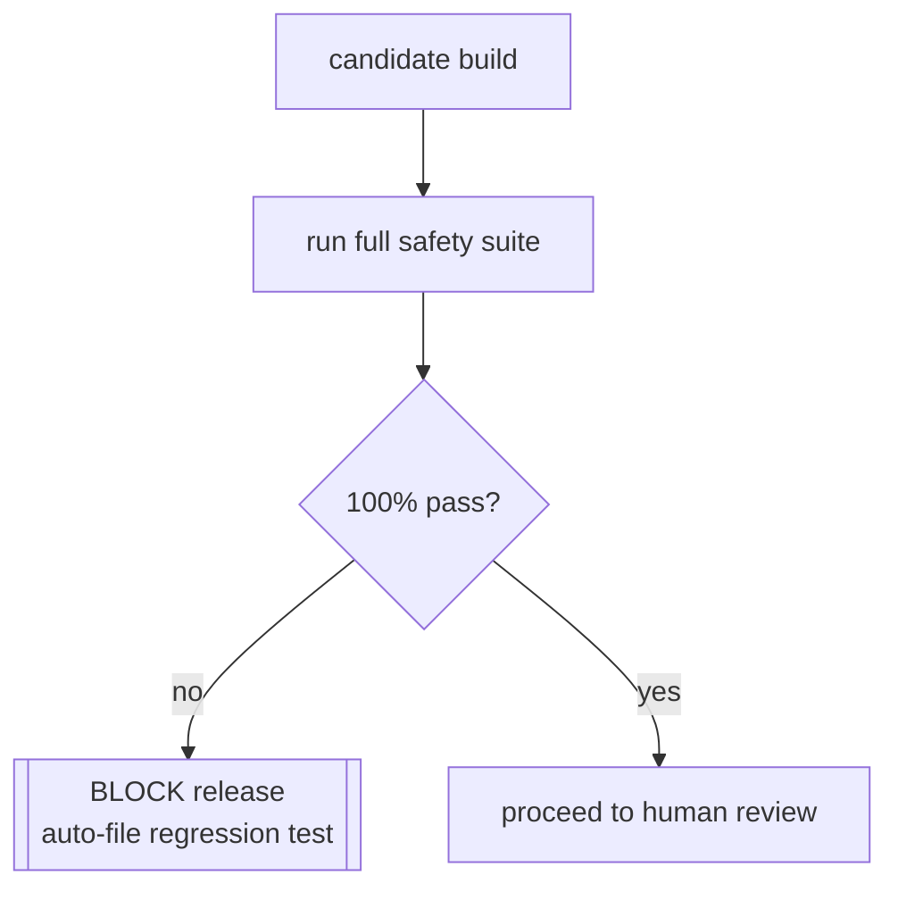

# Continuous Learning Pipeline — NexBank NEXA (C14)

Parent: [`../architecture/README.md`](../architecture/README.md) · Component: **C14** · Owner: ML Platform + Risk & Compliance.

How NEXA improves over time **without ever weakening safety**. This is the "Adaptive" competency: the system learns from real interactions, but the immutable safety layer (C6) is outside the learning loop by construction, so no amount of learning can loosen a safety rule.

---

## 1. The governing principle

> **Learn the *soft* behaviour; never learn the *hard* rules.**

NEXA is split into a **capability core** (what can improve) and an **immutable safety layer** (what must never drift). The learning pipeline is only ever allowed to change the capability core, and every candidate change must pass the full safety suite at 100% before it can reach a single real customer.

| Layer | Examples | Learnable? |
|---|---|---|
| **Immutable safety (C6)** | advice-block, PII rules, auth ladder, money-movement ban, escalation triggers | **No — never** |
| **Capability core** | policy thresholds, clarification strategy, template ranking, retrieval weights, NLU examples, KB gaps | Yes, via the gated pipeline below |

The safety layer is versioned and change-controlled **separately** by Risk & Compliance — it is edited by humans through a governance process, never by the automated loop.

---

## 2. What the system learns from (signals)

| Signal | Source | Used to improve |
|---|---|---|
| **Explicit CSAT** | post-chat 1–5 rating + comment | policy, template quality, escalation timing |
| **Thumbs up/down** | per-turn feedback | response ranking, template selection |
| **Escalation outcomes** | did the human agent resolve what NEXA could not? | intent gaps, missing KB, premature/late escalation |
| **Containment / abandonment** | resolved-without-human vs drop-off | dialogue flow friction points |
| **Repair turns** | user rephrases, "no I meant…" | NLU confusion pairs, clarification prompts |
| **Agent corrections** | human agent edits/notes after takeover | new sample utterances, KB additions |
| **Retrieval hits/misses** | was the retrieved KB entry actually used? | retrieval weights, KB freshness/gaps |
| **Safety interventions** | C2/C6/C10 blocks and false-positive reports | guardrail precision (soft thresholds only) |

Every signal is tied to an anonymised, consented interaction record (see §8 governance).

---

## 3. The learning loop

**Cadence.** Steps 1–2 run continuously; 3–8 run on a scheduled release train (e.g. weekly) plus an emergency path for KB fixes. Nothing skips the gate — even a one-word template tweak runs the full suite.

---

## 4. The safety gate (the hard invariant)

The gate is the single most important mechanism in this project. A candidate is **automatically rejected** unless *all* of the following hold:

1. **Safety suite = 100%.** Every case in the safety & adversarial suite passes. The repo ships **62 representative machine-checked cases** ([`../../tests/`](../../tests/)); production targets **200+**. One failure = hard reject, no override.
2. **No new advice leakage.** The advice-block assertions (`GA-ADV-*`, `GA-ADV-PRESS`) stay green — supports the **0% incorrect-advice** target.
3. **No PII / cross-customer regressions.** `GS-PII-*`, `GS-XCUST-*`, `GS-CRED-*` green.
4. **No auth weakening.** `GS-AUTH-*`, `AD-SPOOF-*` green; no candidate may lower an auth requirement.
5. **Adversarial robustness held.** `AD-INJ-*`, `AD-JAIL-*`, `AD-EXFIL-*` green.

Because these are executed as code against the candidate, "the model got a bit worse at safety" is not a judgement call — it is a build failure.

---

## 5. What improvement actually looks like

| Change type | Example | Guardrail on the change |
|---|---|---|
| **Policy threshold** | raise clarify-vs-answer confidence from 0.60→0.62 to cut misfires | bounded range; safety suite; canary |
| **Template ranking** | prefer a clearer balance-explanation template that scored higher CSAT | templates are pre-approved; C10 still validates facts |
| **Retrieval weights** | nudge `w_dense`/`w_sparse` after miss analysis | offline retrieval eval + latency budget check |
| **NLU examples** | add repaired utterances for a confused intent pair | re-train intent classifier; disambiguation tests |
| **KB gap fill** | add an entry for a frequently-missed question | KB approval workflow + freshness TTL |
| **Escalation timing** | escalate a frustration pattern one turn sooner | escalation tests; false-escalation rate watch |

Note what is **absent**: no row can add, weaken, or bypass a safety rule.

---

## 6. Human-in-the-loop

- **Weekly review queue.** Curators triage low-CSAT and escalated transcripts; label root cause (NLU / KB / policy / genuinely-needs-human).
- **RC sign-off.** Risk & Compliance approves every candidate before canary — required by the RBI Responsible-AI expectation of human oversight and auditable decisions.
- **Safety-rule changes** (the immutable layer) are a *separate* human-only workflow with dual approval; they never originate from the automated loop.

---

## 7. Versioning, canary & rollback

- **Model/version registry.** Every deployed configuration has an immutable version id; the version that produced each response is logged (C12) for full traceability.
- **Canary.** New version serves 1% → 5% → 25% → 100%, watching CSAT, containment, escalation rate, safety-intervention rate, and latency at each step.
- **Circuit breaker & auto-rollback.** Any safety breach, or a canary metric crossing its guard band, trips an automatic rollback to the last known-safe version — the same mechanism the [incident-response playbook](../guardrails/incident-response.md) invokes for B1/B5 breaches.

---

## 8. Data governance for learning

- **Consent & minimisation (DPDP 2023).** Only consented interactions enter the training corpus; only the fields needed for the stated purpose are retained.
- **Anonymisation.** PII is stripped/tokenised before a transcript enters curation; the same masking rules as production (last-4, CVV/PIN/OTP never stored) apply to training data.
- **Retention & deletion.** Training records follow the retention schedule and honour right-to-deletion within 30 days ([`../architecture/audit-logging.md`](../architecture/audit-logging.md)).
- **No safety-critical data in prompts.** Learned artefacts (templates, examples) are scrubbed so no real customer data can resurface in a future response.

---

## 9. Guarding the learner itself

| Risk | Mitigation |
|---|---|
| **Feedback poisoning** (users gaming thumbs to shift behaviour) | anomaly detection on feedback; weight by verified sessions; safety gate is immune regardless |
| **Reward hacking** (optimising CSAT by over-promising) | C10 fact-validation independent of CSAT; advice/claims still blocked |
| **Drift** (slow quality erosion) | rolling drift metrics vs a frozen benchmark set; alarm on divergence |
| **Data leakage into models** | anonymisation + prompt scrubbing + red-team exfil tests (`AD-EXFIL-*`) |
| **Over-blocking creep** | false-positive rate tracked; only *soft* thresholds relaxed, never hard rules |

---

## 10. Metrics for the pipeline

Tracked on the ops dashboard ([`../metrics/`](../metrics/)): candidate pass/fail rate at the gate, time-to-deploy for KB fixes, canary success rate, rollback count, post-release CSAT/containment delta, and drift score. The health goal is *steady safety, rising capability*: safety metrics flat at 100%, capability metrics trending up.
