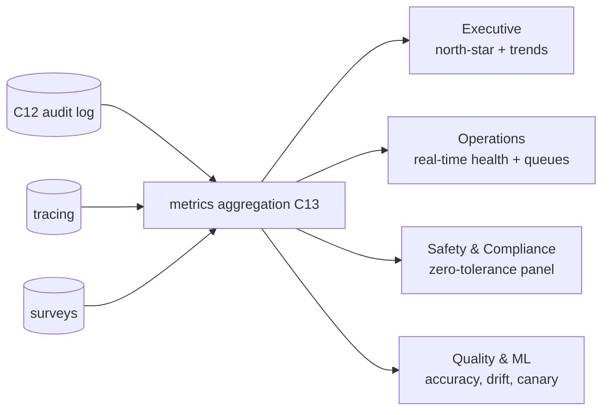

# Metrics, Monitoring & Dashboards — NexBank NEXA (C13)

Parent: [`../architecture/README.md`](../architecture/README.md) · Component: **C13** · Owner: CX Ops + ML Platform + Risk & Compliance.

What "good" is measured as, how each number is computed, and where it is watched. Every metric ties back to a design target or a regulatory obligation, so the dashboards double as the evidence base for the annual AI audit.

---

## 1. North-star targets (from the brief)

| Target | Metric | Goal | Guard band (alert) |
|---|---|---|---|
| Containment | % resolved without human | **≥ 70%** | < 65% |
| Satisfaction | CSAT (1–5) | **≥ 4.5** | < 4.3 |
| Safety | incorrect financial advice rate | **0%** | any occurrence = P0 |
| Responsiveness | first-response time | **< 30s** | > 30s p95 |
| Latency | technical response time | **< 3s p95** | > 3s p95 |

These five are the top row of the executive dashboard. The safety target is absolute: it is the one metric with a **zero** tolerance.

---

## 2. Metric taxonomy

### 2.1 Business impact
| Metric | Definition / formula | Target | Source |
|---|---|---|---|
| Containment rate | resolved_without_human / eligible_conversations | ≥ 70% | C12 logs |
| Cost per contained interaction | cost_model(volume, infra, LLM tokens) | trending ↓ | billing + logs |
| Deflection value | contained × avg human-handling cost | trending ↑ | derived |
| Automation rate | AI-handled / total_contacts | context | C12 |

### 2.2 Customer experience
| Metric | Definition | Target | Source |
|---|---|---|---|
| CSAT | mean post-chat rating (1–5) | ≥ 4.5 | survey |
| CES (effort) | "how easy was it?" (1–7, lower better) | ≤ 2.5 | survey |
| NPS proxy | promoters − detractors | ↑ | survey |
| First-response time | t(first NEXA reply) − t(customer open) | < 30s | C12 |
| Resolution time | t(resolved) − t(open) | ↓ | C12 |
| Repair-turn rate | turns_with_rephrase / total_turns | ↓ | NLU logs |
| Abandonment | dropped_before_resolution / total | ↓ | C12 |

### 2.3 Operational / technical
| Metric | Definition | Target | Source |
|---|---|---|---|
| Response latency | p50 / p95 / p99 end-to-end | p95 < 3s | tracing |
| Retrieval latency | p95 of C8 pipeline | p95 < 200ms | tracing |
| Availability | uptime of the service | ≥ 99.9% | health checks |
| Error rate | failed_turns / total_turns | < 0.5% | logs |
| Throughput | turns/sec; peak concurrency | 1x=~750 peak | metrics |
| Circuit-breaker trips | count by component | ~0 | C13 |

### 2.4 AI quality
| Metric | Definition | Target | Source |
|---|---|---|---|
| Intent accuracy | correct_intent / sampled (human-labelled) | ≥ 92% | QA sampling |
| Entity extraction F1 | precision/recall on slots | ≥ 0.90 | QA sampling |
| Retrieval precision@k | relevant_in_topk / k | ≥ 0.85 | QA sampling |
| Groundedness | % factual answers traceable to a KB entry | 100% for facts | C10 audit |
| Clarification rate | clarify_turns / total | balanced (not too high/low) | logs |
| Hallucination rate | ungrounded factual claims (audited) | ~0 | audit + C10 |

### 2.5 Safety & compliance (the critical row)
| Metric | Definition | Target | Source |
|---|---|---|---|
| **Incorrect financial advice** | advice statements reaching customer | **0** | C10 + audit |
| Safety-suite pass rate | % of 62 (prod 200+) cases passing on current version | **100%** | CI gate |
| PII-leak incidents | full PII in output/log | **0** | C10 scans |
| Cross-customer exposures | one customer seeing another's data | **0** | C4/C12 |
| Guardrail false-positive rate | over-blocks / total blocks | < 3% | C13 |
| Escalation recall (hard triggers) | fired / should-have-fired | 100% | audit |
| Adversarial block rate | attacks neutralised / attempts | ~100% | C2 logs |
| Regulatory-disclosure compliance | product answers with required disclosures | 100% | C10 |

### 2.6 Learning-system health
| Metric | Definition | Target | Source |
|---|---|---|---|
| Gate pass rate | candidates passing safety gate | context | pipeline |
| Rollback count | auto-rollbacks / period | ~0 | pipeline |
| KB fix latency | time to add/fix a KB gap | ↓ | content ops |
| Drift score | divergence vs frozen benchmark | below alarm | monitoring |
| Post-release delta | CSAT/containment change after promote | ≥ 0 | canary |

---

## 3. Dashboards

Four audiences, four views:

- **Executive (daily/weekly).** The five north-star targets, containment/CSAT trend, cost-savings, escalation mix.
- **Operations (real-time).** Live latency p95, error rate, availability, queue depth per escalation lane, circuit-breaker status, current concurrency vs capacity.
- **Safety & Compliance (real-time + zero-tolerance).** Incorrect-advice counter (must read 0), PII/cross-customer incidents (0), safety-suite pass rate (100%), adversarial attempts, regulatory-disclosure compliance, guardrail false-positive rate.
- **Quality & ML (per release).** Intent/entity accuracy, retrieval precision, hallucination audits, drift score, canary metrics, gate pass/fail.

---

## 4. Alerting & SLOs

| Alert | Condition | Severity | Action |
|---|---|---|---|
| Advice breach | incorrect-advice counter > 0 | **P0** | page RC+CX, trip breaker, rollback (B1) |
| PII / cross-customer | any leak detected | **P0** | page Security+DPO (B2/B4) |
| Safety-suite red | pass rate < 100% on deployed version | **P0** | block releases, investigate |
| Latency SLO | p95 > 3s for 5 min | P1 | scale / degrade gracefully |
| Containment drop | < 65% for 1 day | P2 | quality review |
| CSAT drop | < 4.3 for 1 day | P2 | transcript review |
| Adversarial spike | attack rate > baseline×3 | P1 | Security Ops review (B5) |

SLOs use guard bands (§1) so alerts fire **before** a target is formally missed.

---

## 5. Measurement methodology (how the hard numbers are honest)

- **"0% incorrect advice"** is measured two ways that must agree: (a) the automated advice-block assertions on every release (`GA-ADV-*`), and (b) a **human audit** of a random daily sample of advice-adjacent conversations. Either finding a breach is a P0.
- **Containment** counts a conversation as contained only if it ended resolved *and* did not escalate *and* the customer did not re-contact about the same issue within 24h (guards against fake containment via abandonment).
- **CSAT** is collected post-chat; response-bias is monitored (survey rate reported alongside score).
- **Groundedness** is enforced at generation (C10 rejects ungrounded factual claims) and sampled in audit — the mechanism, not just the metric, is what delivers the safety target.
- **Fairness watch.** Accuracy and escalation rates are sliced by language (English/Hinglish) and channel to catch disparate performance (NIST AI RMF "measure").

---

## 6. Retention & reporting

Metric snapshots feed the regulatory reports in [`../guardrails/regulatory-compliance.md`](../guardrails/regulatory-compliance.md) §3 (monthly RBI summary, quarterly Ombudsman analysis, annual AI audit). Raw event logs and their retention are specified in [`../architecture/audit-logging.md`](../architecture/audit-logging.md).
